# 🎯 MLPerf Benchmark Components and Process Guide

## 📋 **Table of Contents**
1. [Core MLPerf Components](#core-mlperf-components)
2. [Benchmark Process Flow](#benchmark-process-flow)
3. [Key Code Sections](#key-code-sections)
4. [Multi-GPU Coordination](#multi-gpu-coordination)
5. [Understanding the Results](#understanding-the-results)

---

## 🔧 **Core MLPerf Components**

### **1. Main MLPerf Benchmark Engine**
**File:** `mlperf_datacenter_benchmark.py`  
**Purpose:** Core MLPerf Inference v5.0 Server scenario implementation

#### **🎯 Key MLPerf Classes and Functions:**

```python
class MLPerfDatacenterBenchmark:
    """
    THE HEART OF MLPERF BENCHMARKING
    This class contains all the core MLPerf logic
    """
```

**Critical Methods:**

| Method | Purpose | MLPerf Importance |
|--------|---------|------------------|
| `validate_environment()` | Ensures CUDA, PyTorch, HuggingFace are available | ⭐⭐⭐ **Essential** - MLPerf requires verified environment |
| `load_model()` | Loads Llama-3.1-8B-Instruct with optimal config | ⭐⭐⭐ **Essential** - Model loading must be reproducible |
| `run_server_scenario()` | **THE CORE MLPERF BENCHMARK** | ⭐⭐⭐ **CRITICAL** - This IS the MLPerf benchmark |
| `run_benchmark()` | Orchestrates the complete pipeline | ⭐⭐⭐ **Essential** - Main execution flow |

---

### **2. Multi-GPU Coordination Engine**
**File:** `run_datacenter_benchmark.py`  
**Purpose:** Coordinates MLPerf benchmarks across multiple GPU nodes

#### **🌐 Key Coordination Functions:**

| Function | Purpose | Role in MLPerf |
|----------|---------|----------------|
| `run_datacenter_benchmark_on_node()` | Executes benchmark on single GPU via SSH | Remote execution |
| `collect_results_from_node()` | Retrieves results from remote GPU nodes | Result aggregation |
| `run_coordinated_datacenter_benchmark()` | **MAIN ORCHESTRATOR** | Multi-GPU coordination |

---

### **3. Configuration Management**
**File:** `config.py`  
**Purpose:** Centralized, environment-agnostic configuration

#### **⚙️ Key Configuration Elements:**

```python
class MLPerfConfig:
    # Model configuration
    self.model_name = "meta-llama/Llama-3.1-8B-Instruct"
    
    # MLPerf benchmark parameters
    self.max_tokens = 64                    # Output token limit
    self.server_target_qps = 0.5           # Performance target
    
    # Multi-GPU cluster nodes
    self.nodes = {
        'jw2': '129.254.202.252',  # A30 GPU
        'jw3': '129.254.202.253'   # A30 GPU
    }
```

---

## 🔄 **Benchmark Process Flow**

### **📊 Single-GPU MLPerf Process**

```mermaid
graph TD
    A[Start Benchmark] --> B[Validate Environment]
    B --> C{CUDA Available?}
    C -->|No| D[❌ FAIL]
    C -->|Yes| E[Load Model]
    E --> F[Load Llama-3.1-8B]
    F --> G[🎯 RUN SERVER SCENARIO]
    G --> H[Process 20 Test Samples]
    H --> I[Calculate MLPerf Metrics]
    I --> J[Validate QPS Target]
    J --> K{QPS >= Target?}
    K -->|Yes| L[✅ PASS]
    K -->|No| M[❌ FAIL]
    L --> N[Save Results]
    M --> N
```



### **🌐 Multi-GPU Coordination Process**


---

## 🔍 **Key Code Sections**

### **🎯 THE CORE MLPERF BENCHMARK CODE**
**Location:** `mlperf_datacenter_benchmark.py:202-398`

This is **THE MOST IMPORTANT** section - the actual MLPerf benchmark implementation:

```python
def run_server_scenario(self) -> Dict[str, Any]:
    """
    ⭐⭐⭐ THIS IS THE CORE MLPERF BENCHMARK ⭐⭐⭐
    
    This function IS the MLPerf benchmark. Everything else is setup.
    """
    
    # 1. CREATE INFERENCE PIPELINE
    pipe = pipeline("text-generation", model=self.model, tokenizer=self.tokenizer)
    
    # 2. MLPERF TEST DATASET (Lines 260-281)
    test_samples = [
        "Explain the concept of machine learning in simple terms.",
        # ... 19 more carefully curated prompts
    ]
    
    # 3. ⭐ CORE BENCHMARK LOOP ⭐ (Lines 292-330)
    for i, sample in enumerate(test_samples, 1):
        sample_start = time.time()
        
        # THIS IS THE ACTUAL MLPERF INFERENCE
        response = pipe(
            sample,
            max_new_tokens=self.max_tokens,
            temperature=0.7,
            do_sample=True,
            pad_token_id=self.tokenizer.eos_token_id
        )[0]
        
        sample_end = time.time()
        # Record latency, tokens, etc.
    
    # 4. MLPERF METRICS CALCULATION (Lines 332-380)
    # - Calculate QPS (Queries Per Second)
    # - Calculate latency percentiles (P50, P90, P99)
    # - Validate against MLPerf targets
```

### **🔧 Environment Validation**
**Location:** `mlperf_datacenter_benchmark.py:100-142`

```python
def validate_environment(self) -> bool:
    """Critical MLPerf prerequisite validation"""
    
    # 1. CUDA Check - MLPerf requires GPU
    if not torch.cuda.is_available():
        return False
    
    # 2. GPU Info Collection
    gpu_name = torch.cuda.get_device_name()
    gpu_memory = torch.cuda.get_device_properties(0).total_memory / 1e9
    
    # 3. Required Libraries
    import transformers  # For model loading
```

### **🤖 Model Loading**
**Location:** `mlperf_datacenter_benchmark.py:144-200`

```python
def load_model(self) -> bool:
    """Load Llama model with MLPerf-optimized configuration"""
    
    # Load tokenizer
    self.tokenizer = AutoTokenizer.from_pretrained(self.model_name)
    
    # Load model with optimization
    self.model = AutoModelForCausalLM.from_pretrained(
        self.model_name,
        torch_dtype=torch.float16,    # Memory efficiency
        device_map="auto",            # Automatic GPU placement
        trust_remote_code=True
    )
```

### **📊 MLPerf Metrics Calculation**
**Location:** `mlperf_datacenter_benchmark.py:332-380`

```python
# Extract latencies and calculate percentiles
latencies = [r['latency_ms'] for r in results]
latencies.sort()

latency_p50 = get_percentile(latencies, 50)   # Median
latency_p90 = get_percentile(latencies, 90)   # 90th percentile  
latency_p99 = get_percentile(latencies, 99)   # 99th percentile (critical)

# Primary MLPerf metric
qps = len(results) / total_duration

# MLPerf validation
is_valid = qps >= self.server_target_qps * 0.9  # 90% of target
```

---

## 🌐 **Multi-GPU Coordination**

### **SSH-Based Remote Execution**
**Location:** `run_datacenter_benchmark.py:39-120`

```python
def run_datacenter_benchmark_on_node(node_name, node_ip, log_file, results_container):
    """Execute MLPerf on remote GPU node"""
    
    # 1. Environment setup for remote node
    env_vars = {
        'NODE_NAME': node_name,
        'SERVER_TARGET_QPS': '0.5',
        'CUDA_VISIBLE_DEVICES': '0'
    }
    
    # 2. Build SSH command
    ssh_command = f"{env_str} && python3 mlperf_datacenter_benchmark.py"
    cmd = config.get_ssh_command(node_name, ssh_command)
    
    # 3. Execute remotely with logging
    with open(log_file, 'w') as f:
        process = subprocess.Popen(cmd, stdout=f, stderr=subprocess.STDOUT)
        return_code = process.wait()
```

### **Result Collection**
**Location:** `run_datacenter_benchmark.py:122-194`

```python
def collect_results_from_node(node_name, node_ip, results_container):
    """Collect results from remote GPU"""
    
    # 1. Find latest results file on remote node
    cmd = ['ssh', f'{username}@{node_ip}', 
           f'find ~/MLPerf_local_test/results -name "mlperf_datacenter_{node_name}_*.json"']
    
    # 2. Copy results to controller
    copy_cmd = ['scp', f'{username}@{node_ip}:{remote_file}', local_file]
    
    # 3. Load and store results
    with open(local_file, 'r') as f:
        results_container[node_name] = json.load(f)
```

---

## 📈 **Understanding the Results**

### **🎯 MLPerf Server Scenario Metrics**

| Metric | Description | Importance | Target |
|--------|-------------|------------|--------|
| **QPS** | Queries Per Second | ⭐⭐⭐ **Primary MLPerf metric** | ≥ 0.45 (90% of 0.5) |
| **Latency P99** | 99th percentile latency | ⭐⭐⭐ **Critical for user experience** | < 3000ms |
| **TTFT** | Time To First Token | ⭐⭐ **Responsiveness** | Same as latency |
| **TPOT** | Time Per Output Token | ⭐⭐ **Efficiency** | Calculated |
| **Throughput** | Tokens per second | ⭐⭐ **Bandwidth** | ~35 tokens/sec per A30 |
| **Accuracy** | Response quality | ⭐⭐⭐ **MLPerf requirement** | 100% (assumed) |

### **✅ Success Criteria**

```python
# MLPerf validation logic
is_valid = qps >= self.server_target_qps * 0.9  # Must achieve 90% of target QPS

# For A30 GPU:
# Target QPS: 0.5
# Minimum QPS: 0.45
# Typical achieved: 0.50-0.54
```

### **📊 Multi-GPU Aggregation**

```python
# Cluster performance calculation
total_server_qps = sum(qps for each successful GPU)
total_throughput = sum(throughput for each successful GPU)
average_per_gpu = total_throughput / successful_node_count

# For 2x A30 cluster:
# Combined QPS: ~1.03
# Total throughput: ~67 tokens/sec
# Average per GPU: ~33.5 tokens/sec
```

---

## 🚀 **Quick Reference**

### **Running Single GPU Benchmark**
```bash
export NODE_NAME=jw2
python3 mlperf_datacenter_benchmark.py
```

### **Running Multi-GPU Coordinated Benchmark**
```bash
python3 run_datacenter_benchmark.py
```

### **Key Files Generated**
- `mlperf_datacenter_{node}_{timestamp}.json` - Detailed results
- `mlperf_datacenter_{node}_{timestamp}.txt` - Human-readable summary
- `aggregated_datacenter_results.json` - Multi-GPU combined results
- `benchmark_summary.txt` - Cluster performance summary

---

## 🎯 **Summary**

The **CORE** of the MLPerf benchmark is the `run_server_scenario()` function in `mlperf_datacenter_benchmark.py`. This function:

1. **Loads the test dataset** (20 carefully chosen prompts)
2. **Processes each prompt individually** (Server scenario requirement)
3. **Measures timing and token metrics** for each request
4. **Calculates MLPerf-compliant statistics** (QPS, latency percentiles)
5. **Validates performance against targets** (Pass/Fail determination)

Everything else is infrastructure:
- Environment validation ensures prerequisites
- Model loading prepares the AI system
- Multi-GPU coordination scales across hardware
- Result aggregation combines multiple runs
- Reporting presents results in standard formats

The benchmark success is determined by **achieving target QPS with acceptable latency** - currently 0.5 QPS per A30 GPU with P99 latency under reasonable limits.