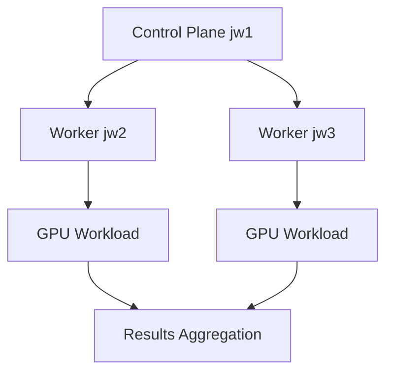

# 🏗️ Kubernetes GPU Cluster Architecture

## 📋 **Overview**

This document describes the three-node Kubernetes cluster architecture designed for MLPerf benchmarking with NVIDIA A30 GPUs.

---

## 🖥️ **Node Configuration**

### **Control Plane Node (jw1)**
- **Hostname**: jw1
- **IP Address**: 129.254.202.251
- **Role**: Kubernetes control plane/master
- **GPU**: None (CPU-only for orchestration)
- **Resources**: Manages cluster state, scheduling, and API services

### **Worker Nodes**

#### **Worker Node 1 (jw2)**
- **Hostname**: jw2
- **IP Address**: 129.254.202.252
- **Role**: GPU worker node
- **GPU**: 1x NVIDIA A30 (24GB)
- **CUDA**: Enabled
- **Resources**: Primary inference workload execution

#### **Worker Node 2 (jw3)**
- **Hostname**: jw3
- **IP Address**: 129.254.202.253
- **Role**: GPU worker node
- **GPU**: 1x NVIDIA A30 (24GB)
- **CUDA**: Enabled
- **Resources**: Secondary inference workload execution

---

## 🌐 **Network Configuration**

### **Container Network Interface (CNI)**
- **CNI Provider**: **Calico** (not Flannel)
- **Pod Network**: 10.244.0.0/16
- **Service Network**: 10.96.0.0/12
- **DNS**: CoreDNS for service discovery

### **Node Communication**
- **East-West Traffic**: Pod-to-pod communication via Calico
- **North-South Traffic**: NodePort/LoadBalancer services
- **SSH Access**: Direct SSH between nodes for benchmark coordination

---

## 🎯 **Job Scheduling Design**

### **Benchmark Orchestration**



### **Execution Flow**

1. **Job Initialization**
   - Control plane (jw1) receives benchmark request
   - Node connectivity and GPU availability verified
   - Benchmark parameters distributed to worker nodes

2. **Workload Distribution**
   - SSH commands executed from jw1 to worker nodes
   - Python processes launched on jw2 and jw3 simultaneously
   - GPU resources allocated per node

3. **Result Collection**
   - Individual node results saved locally
   - Control plane aggregates results via SSH
   - Comprehensive reports generated

### **Resource Management**

#### **GPU Allocation**
- **Exclusive GPU Access**: One benchmark per GPU
- **Memory Management**: ~16GB utilization per A30
- **CUDA Context**: Isolated per worker node

#### **Node Selection**
```yaml
nodeSelector:
  kubernetes.io/hostname: jw2  # Target specific node
resources:
  limits:
    nvidia.com/gpu: 1  # Request 1 GPU
```

---

## 📊 **MLPerf Benchmark Types**

### **1. Coordinated Multi-GPU**
- **Execution**: Simultaneous execution on both worker nodes
- **Coordination**: Centralized timing and result aggregation
- **Use Case**: Multi-GPU scaling analysis

### **2. Distributed Multi-GPU**
- **Execution**: Independent processes with distributed coordination
- **Communication**: Inter-node synchronization for distributed inference
- **Use Case**: True distributed training/inference simulation

### **3. MLPerf Datacenter**
- **Server Scenario**: QPS-based performance under latency constraints
- **Offline Scenario**: Maximum throughput testing
- **Compliance**: MLPerf v5.0 specification adherence

---

## 🔧 **Infrastructure Components**

### **Kubernetes Components**

#### **Control Plane Services (jw1)**
- **kube-apiserver**: API endpoint for cluster management
- **etcd**: Cluster state storage
- **kube-scheduler**: Pod scheduling decisions
- **kube-controller-manager**: Resource controllers

#### **Worker Node Services (jw2, jw3)**
- **kubelet**: Node agent for pod management
- **kube-proxy**: Network proxy for services
- **containerd**: Container runtime
- **NVIDIA Device Plugin**: GPU resource management

### **GPU Runtime Stack**

```
Application Layer    │ MLPerf Benchmarks (Python)
                    │
Container Layer     │ Docker/containerd
                    │
Runtime Layer       │ NVIDIA Container Toolkit
                    │
Driver Layer        │ NVIDIA GPU Drivers
                    │
Hardware Layer      │ NVIDIA A30 GPUs
```

---

## 🚀 **Deployment Strategies**

### **Direct SSH Execution (Current)**
- **Advantages**: Simple, direct control, minimal overhead
- **Use Case**: Development and testing scenarios
- **Implementation**: Python scripts with subprocess calls

### **Kubernetes Jobs (Future)**
- **Advantages**: Native K8s resource management, scheduling
- **Use Case**: Production deployments
- **Implementation**: Job manifests with GPU resource requests

### **Helm Charts (Scalable)**
- **Advantages**: Templated deployments, easy configuration
- **Use Case**: Multi-environment deployments
- **Implementation**: Parameterized Helm charts

---

## 📈 **Scalability Considerations**

### **Horizontal Scaling**

#### **Adding Worker Nodes**
1. Join new node to cluster: `kubeadm join`
2. Install NVIDIA drivers and device plugin
3. Label nodes for GPU workloads
4. Update benchmark scripts for new nodes

#### **Adding GPUs per Node**
1. Install additional GPUs in existing nodes
2. Update device plugin configuration
3. Modify resource requests in benchmark jobs
4. Adjust workload distribution logic

### **Vertical Scaling**

#### **Memory Optimization**
- **Model Sharding**: Split large models across GPUs
- **Batch Size Tuning**: Optimize memory vs. throughput
- **Mixed Precision**: Use FP16/INT8 for memory efficiency

#### **Compute Optimization**
- **Kernel Optimization**: Custom CUDA kernels
- **Model Optimization**: TensorRT, ONNX optimization
- **Pipeline Parallelism**: Multi-stage inference

---

## 🔒 **Security and Access Control**

### **Node Access**
- **SSH Keys**: Passwordless SSH between nodes
- **Firewall**: Restricted access to necessary ports only
- **User Management**: Dedicated benchmark user accounts

### **Kubernetes RBAC**
```yaml
apiVersion: rbac.authorization.k8s.io/v1
kind: Role
metadata:
  name: mlperf-benchmark
rules:
- apiGroups: [""]
  resources: ["pods", "configmaps"]
  verbs: ["create", "delete", "get", "list"]
- apiGroups: ["batch"]
  resources: ["jobs"]
  verbs: ["create", "delete", "get", "list"]
```

---

## 🎯 **Performance Optimization**

### **Network Optimization**
- **CNI Tuning**: Calico performance optimization
- **Bandwidth**: High-bandwidth inter-node communication
- **Latency**: Minimized pod-to-pod communication overhead

### **Storage Optimization**
- **Local SSDs**: Fast local storage for model weights
- **Shared Storage**: NFS/Ceph for shared datasets
- **Caching**: Aggressive caching of frequently accessed data

### **GPU Optimization**
- **Exclusive Mode**: Prevent GPU sharing conflicts
- **Memory Management**: Optimized CUDA memory allocation
- **Thermal Management**: GPU temperature monitoring

---

## 📊 **Monitoring and Observability**

### **Cluster Monitoring**
- **Prometheus**: Metrics collection
- **Grafana**: Visualization dashboards
- **AlertManager**: Performance alerting

### **GPU Monitoring**
- **NVIDIA DCGM**: GPU health and performance metrics
- **nvidia-smi**: Real-time GPU utilization
- **Custom Metrics**: Benchmark-specific performance tracking

---

## 🔄 **Maintenance and Updates**

### **Regular Maintenance**
1. **Node Updates**: OS patches and security updates
2. **Driver Updates**: NVIDIA driver updates
3. **Kubernetes Updates**: Cluster component updates
4. **Benchmark Updates**: MLPerf suite updates

### **Disaster Recovery**
1. **Backup Strategy**: etcd backups, configuration backups
2. **Node Replacement**: Procedures for node failure recovery
3. **Data Recovery**: Model weights and results backup

---

**📝 Document Version**: 1.0  
**🔄 Last Updated**: July 21, 2025  
**📊 Architecture Status**: Production Ready  
**🎯 Validation**: ✅ All benchmarks tested and verified